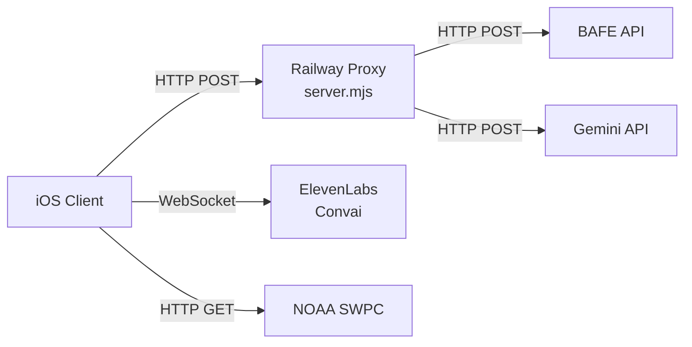
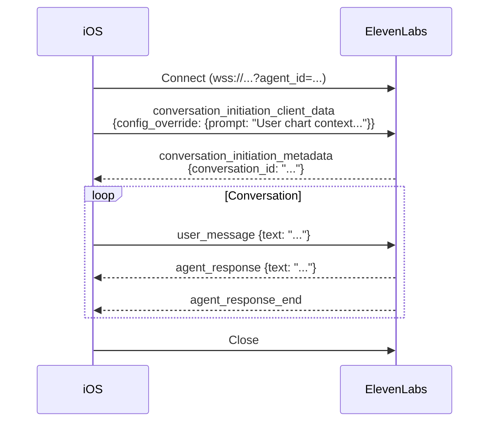

# API Design

## Overview

The iOS client consumes 4 external APIs. All authenticated calls go through the Railway proxy (`server.mjs`) to avoid API keys in the binary (`REQ-SEC-no-keys-in-binary`).



## 1. BAFE Astrology API (`REQ-F-fusion-calculation`)

**Base URL:** via Railway proxy at `/api/calculate/`

### Endpoints (all POST)

| Endpoint | Request | Response | Maps to |
|----------|---------|----------|---------|
| `/api/calculate/bazi` | `BAFERequest` | `BAFEBaziResponse` | `BaZiData` |
| `/api/calculate/western` | `BAFERequest` | `BAFEWesternResponse` | `WesternData` |
| `/api/calculate/wuxing` | `BAFERequest` | `BAFEWuXingResponse` | `WuXingData` |
| `/api/calculate/fusion` | `BAFERequest` | `BAFEFusionResponse` | Theme metadata |

### Request Payload (`BAFERequest`)

```json
{
  "date": "1990-01-15T14:30:00",
  "tz": "Europe/Berlin",
  "lon": 11.5820,
  "lat": 48.1351,
  "standard": "CIVIL",
  "boundary": "midnight",
  "strict": true,
  "ambiguousTime": "earlier",
  "nonexistentTime": "error"
}
```

### Execution Pattern

All 4 endpoints called in parallel (`async let`). Individual failures are caught and fallback to empty responses — partial results still render (`REQ-REL-bafe-fallback`). Timeout: 20s per endpoint. Target total: <5s under normal conditions (`REQ-PERF-api-response`).

### Key Response Mappings

| BAFE Field | iOS Model Field | Transformation |
|-----------|----------------|----------------|
| `bodies.Sun.zodiac_sign` (0-11) | `WesternData.sunSign` | Index → `ZodiacSign.allCases[i]` |
| `bodies.Sun.longitude` (0-360) | `WesternData.sunDegree` | `degree % 30` (within sign) |
| `angles.Ascendant` (degrees) | `WesternData.ascendant` | `floor(degree / 30)` → sign |
| `bodies.*.speed < 0` | `PlanetPosition.isRetrograde` | Negative speed = retrograde |
| `houses["1"]-["12"]` (degrees) | `WesternData.houseStarts` | Direct array |
| `pillars.day.stamm` | `BaZiData.day.stem` | Lookup in `HeavenlyStemDatabase` |
| `wu_xing_vector.Holz` etc. | `WuXingData.balance` | Normalize: value / max → 0-1 |

## 2. Gemini Interpretation API (`REQ-REL-bafe-fallback`)

**Endpoint:** `POST /api/interpret` (via Railway proxy)

### Request

```json
{
  "lang": "de",
  "data": {
    "name": "Layla",
    "birthPlace": "München, Deutschland",
    "bazi": { "day_master": "壬", "year_stem": "己", ... },
    "western": { "sun_sign": "Capricorn", "moon_sign": "Scorpio", "ascendant_sign": "Gemini" },
    "wuxing": { "dominant": "Wasser", "vector": { "Holz": 3, ... } }
  }
}
```

### Response

```json
{
  "interpretation": "Deine kosmische Signatur vereint...",
  "tiles": { "sun": "...", "moon": "...", "dayMaster": "..." },
  "houses": { "1": "...", "7": "..." }
}
```

### Fallback Chain

1. Gemini proxy responds → use `interpretation`
2. Proxy fails → `GeminiService.templateInterpretation()` generates basic text from BAFE data
3. Both fail → static fallback message

## 3. ElevenLabs Conversational AI (`REQ-F-companion-websocket`)

**Protocol:** WebSocket  
**URL:** `wss://api.elevenlabs.io/v1/convai/conversation?agent_id={AGENT_ID}`

### Agent IDs

| Agent | ID | Personality |
|-------|----|------------|
| Levi | `agent_1801kje0zqc8e4b89swbt7wekawv` | Analytical, clear, profound |
| Eve | `agent_9101kmntjynwfz6t2ep687a6qb09` | Direct, ironic, honest, close |

### WebSocket Message Flow



### Context Payload

`ElevenLabsService.buildContext()` sends the full natal chart as system prompt:

```
Nutzer-Profil:
Name: Layla | Geburtsort: München
Western: Sonne Steinbock 24.7° | Mond Skorpion 11.3° | ASC Zwillinge 7.9°
BaZi: Tag 壬寅 | Jahr 己巳 | Monat 癸丑 | Stunde 癸未
Wu-Xing Dominant: Wasser | Schwächstes: Metall
Sprache: Deutsch
```

### Fallback

WebSocket failure → local preset responses (5-6 personality-specific strings per agent).

## 4. NOAA Space Weather API (`REQ-F-cosmic-weather`)

**Endpoint:** `GET https://services.swpc.noaa.gov/json/planetary_k_index_1m.json`  
**Auth:** None (public government API)  
**Cache:** 15 minutes (`CosmicWeatherService.cacheTTL`)

### Response (last entry used)

```json
{
  "time_tag": "2026-03-28T01:15:00",
  "kp_index": 3,
  "estimated_kp": 3.0,
  "kp": "3Z"
}
```

### Fallback Chain

1. NOAA responds → use `estimated_kp`
2. NOAA fails → NASA DONKI fallback (server-side, implemented in `server.mjs`)
3. Both fail → `kpIndex = 0` (neutral, no storm effects)

## 5. MapKit / CoreLocation (`REQ-F-geocoding`)

**Not an external API** — uses Apple's built-in frameworks:

| Framework | Usage |
|-----------|-------|
| `MKLocalSearchCompleter` | Autocomplete suggestions as user types |
| `MKLocalSearch` | Resolve suggestion → coordinate |
| `CLGeocoder` | Reverse geocode → IANA timezone |

No API key needed. Rate limits handled by Apple's infrastructure.

## Error Handling Pattern

All services follow the same pattern:

```swift
do {
    let result = try await service.fetch()
    // Success path
} catch {
    // Log error
    // Use fallback (cached data, template, preset, or neutral default)
    // Show user-facing message only for critical failures (new user, no cache)
}
```

No error silently swallowed. No error shown to user unless it blocks functionality they initiated (`REQ-REL-bafe-fallback`).
