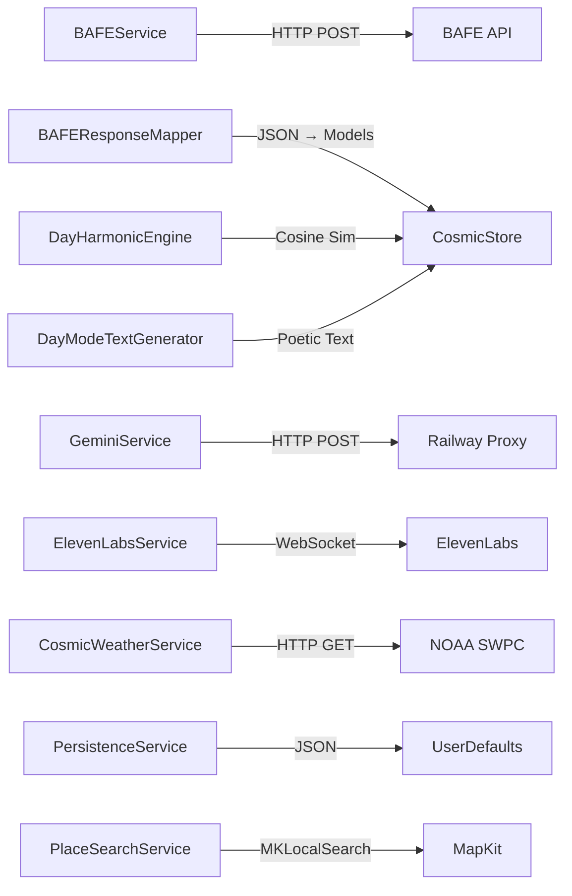
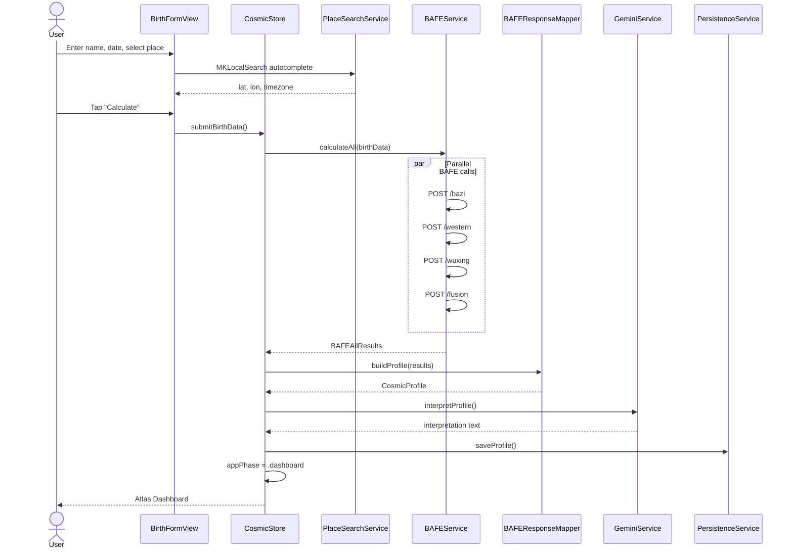

# Architecture

## System Overview

Bazodiac iOS is a client-heavy native app that computes and displays a Fusion Astrology profile. The client handles all UI rendering, local persistence, and real-time visual signatures. External services provide astrology calculations (BAFE), AI interpretation (Gemini), voice companions (ElevenLabs), and cosmic weather (NOAA).

```mermaid
graph TB
    subgraph "iOS Client (SwiftUI)"
        UI[UI Layer<br/>Views + Canvas]
        Store[CosmicStore<br/>@Observable State]
        Services[Service Layer]
        Persist[PersistenceService<br/>UserDefaults]
    end

    subgraph "External Services"
        BAFE[BAFE API<br/>Astrology Engine]
        Proxy[Railway Proxy<br/>server.mjs]
        Gemini[Gemini API<br/>Interpretation]
        EL[ElevenLabs<br/>Conversational AI]
        NOAA[NOAA SWPC<br/>Kp-Index]
    end

    subgraph "Future"
        Supa[Supabase<br/>Auth + DB]
    end

    UI --> Store
    Store --> Services
    Store --> Persist
    Services --> BAFE
    Services --> Proxy
    Proxy --> Gemini
    Services -->|WebSocket| EL
    Services --> NOAA
    Services -.-> Supa
```

## Components

### 1. UI Layer (Views)

| Component | File(s) | Requirements |
|-----------|---------|-------------|
| Splash + Onboarding | `SplashView`, `BirthFormView` | `REQ-F-geocoding`, `REQ-F-bilingual` |
| Atlas Dashboard | `HomeView`, `DayModeCard`, `CosmicTriad` | `REQ-F-day-mode-selection`, `REQ-F-detail-sheets` |
| Detail Sheets | `DetailSheets.swift` | `REQ-F-detail-sheets` |
| Western Chart | `WesternChartView` | `REQ-F-fusion-calculation` |
| BaZi Pillars | `BaZiView` | `REQ-F-fusion-calculation` |
| Wu-Xing Pentagon | `WuXingView` | `REQ-F-fusion-calculation` |
| Quizzes | `QuizzesView`, `QuizPlayView`, `QuizResultView` | `REQ-F-quiz-scoring` |
| Companions | `AgentsView`, `LeviView`, `EveView` | `REQ-F-companion-websocket` |
| Signatur V3 | _planned_ | `GOAL-dynamic-signature` |

All views read from `CosmicStore` via `@Environment` and use `CosmicTheme` for dark/light theming (`REQ-F-bilingual`, `REQ-USA-no-astro-jargon`).

### 2. CosmicStore (State Management)

Single `@Observable` `@MainActor` object injected at app root. Holds:

- `appPhase: AppPhase` — splash / birthForm / dashboard
- `profile: CosmicProfile?` — the complete Fusion profile
- `theme: CosmicTheme` — dark / light
- `language: Language` — de / en
- `selectedTab: Tab` — current tab

**No Combine, no Redux.** Direct property mutation with `withAnimation`. The store is the single source of truth (`REQ-F-profile-persistence`).

### 3. Service Layer



| Service | Responsibility | Requirements |
|---------|---------------|-------------|
| `BAFEService` | Parallel HTTP calls to 4 BAFE endpoints | `REQ-F-fusion-calculation`, `REQ-PERF-api-response` |
| `BAFEResponseMapper` | JSON → `WesternData`, `BaZiData`, `WuXingData` | `REQ-F-fusion-calculation` |
| `GeminiService` | Interpretation via proxy + template fallback | `REQ-REL-bafe-fallback` |
| `ElevenLabsService` | WebSocket to Convai agents, text I/O | `REQ-F-companion-websocket` |
| `ConversationHandler` | Per-agent WebSocket lifecycle (Levi/Eve) | `REQ-F-companion-websocket` |
| `CosmicWeatherService` | NOAA Kp-Index + synodic moon phase | `REQ-F-cosmic-weather` |
| `DayHarmonicEngine` | H = cosine similarity → Pulse/Trace | `REQ-F-day-mode-selection` |
| `DayModeTextGenerator` | Poetic text generation (no jargon) | `REQ-USA-no-astro-jargon` |
| `PersistenceService` | UserDefaults JSON codec | `REQ-F-profile-persistence` |
| `PlaceSearchService` | MKLocalSearch + CLGeocoder | `REQ-F-geocoding` |
| `QuizEngine` | Dimension scoring + profile matching | `REQ-F-quiz-scoring` |

### 4. Persistence Layer

Local-only via `UserDefaults` (no CoreData, no SwiftData). Stored as JSON:

| Key | Content | TTL |
|-----|---------|-----|
| `cosmicProfile` | Full `CosmicProfile` (Western + BaZi + WuXing + interpretation) | Permanent |
| `birthData` | Name, date, place, lat/lon/tz | Permanent |
| `theme` | "dark" / "light" | Permanent |
| `language` | "de" / "en" | Permanent |
| `completedQuizzes` | `[String]` of quiz IDs | Permanent |
| `dailyQuote` | Today's quote text | 1 day |

**No secret storage.** Supabase anon key is compile-time only. No API keys in persistence (`REQ-SEC-no-keys-in-binary`).

## Data Flow: Birth Submission → Dashboard



## Security Model

- **No secrets in binary** (`REQ-SEC-no-keys-in-binary`): Gemini/Stripe keys live server-side only
- **Supabase anon key**: read-only, RLS-enforced — acceptable in binary
- **ElevenLabs**: public agent WebSocket, no API key needed
- **NOAA**: public government API, no authentication
- **BAFE**: routed through Railway proxy (server.mjs adds auth headers)

## Offline Behavior (`REQ-REL-bafe-fallback`, `REQ-F-profile-persistence`)

| State | Behavior |
|-------|----------|
| First launch, no internet | Error: "Internet required for first calculation" + retry |
| Returning user, no internet | Full dashboard from cached profile; Day Pulse/Trace from last fetch |
| BAFE partial failure | Individual endpoints fail gracefully; available data still shown |
| Gemini unavailable | Template-based interpretation fallback |
| NOAA unavailable | Kp defaults to 0 (neutral weather) |
| ElevenLabs unavailable | Local preset responses for companions |
