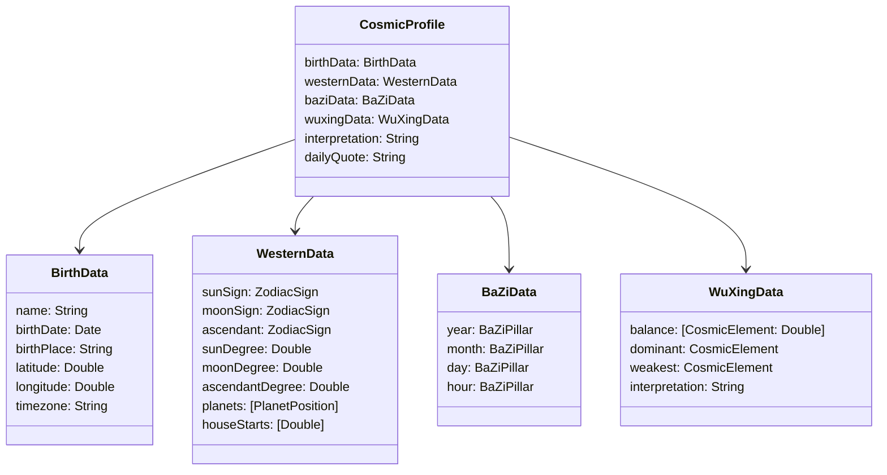
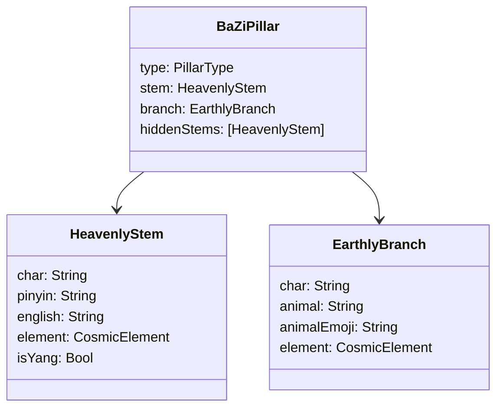

# Data Model

## Core Domain Models

All models are Swift structs (value types) unless marked as `@Observable class`.

## Enums

| Enum | Values | Used by |
|------|--------|---------|
| `ZodiacSign` | aries…pisces (12) | `WesternData`, `PlanetPosition` |
| `ZodiacElement` | fire, earth, air, water | `ZodiacSign.element` |
| `CosmicElement` | wood, fire, earth, metal, water | `WuXingData`, `BaZiPillar` |
| `Planet` | sun…pluto (10) | `PlanetPosition` |
| `DayMode` | pulse, trace | `DayHarmonicState` |
| `MoonPhase` | newMoon…waningCrescent (8) | `CosmicWeather` |
| `AppPhase` | splash, birthForm, dashboard | `CosmicStore` |
| `CosmicTheme` | dark, light | `CosmicStore` |
| `ConvaiAgent` | levi, eve | `ElevenLabsService` |

## BaZi Sub-Models

**Reference data:** `HeavenlyStemDatabase` (10 stems) and `EarthlyBranchDatabase` (12 branches) provide lookup by Chinese character. These are compile-time constants, not API-fetched.

## Computed / Derived Models

| Model | Computed from | Formula | Ref |
|-------|--------------|---------|-----|
| `DayHarmonicState` | `CosmicProfile` | H = cos_sim(Western_WuXing_Vec, BaZi_WuXing_Vec); mode = H ≥ 0.50 ? trace : pulse; intensity = \|H - 0.45\| / 0.55 | `REQ-F-day-mode-selection` |
| `CosmicWeather` | NOAA API + date | kpIndex from SWPC JSON; moonPhase from synodic month calculation | `REQ-F-cosmic-weather` |
| `DayPulse` | `CosmicProfile` + `CosmicWeather` | Fused text from element, moon phase, natal archetype | `REQ-USA-no-astro-jargon` |

## Quiz Models

| Model | Purpose |
|-------|---------|
| `FullQuiz` | Definition: id, title, questions[], profiles[], dimensions[] |
| `QuizQuestion` | id, text, context, options[] |
| `QuizOption` | id, text, scores: [dimension: weight] |
| `QuizProfile` | id, title, tagline, description, icon, color, stats[], allies[] |
| `QuizEngine` | Static methods: calculateScores() → normalize → matchProfile() |

Scoring: `REQ-F-quiz-scoring` — raw dimension sums / (questionCount × 5) × 100, then dominant dimension → profile match.

## Persistence Schema (`REQ-F-profile-persistence`)

All persistence uses `UserDefaults` with JSON encoding via `Codable` wrappers:

| Codable Wrapper | Source Model | Notes |
|----------------|-------------|-------|
| `ProfileStorage` | `CosmicProfile` | Flattened: sign raw values, planet arrays, pillar chars |
| `BirthDataStorage` | `BirthData` | Direct field mapping |
| `PillarStorage` | `BaZiPillar` | Stem char + branch char (looked up on decode) |
| `PlanetStorage` | `PlanetPosition` | Planet raw + degree + sign raw + house + retrograde |

## BAFE Response Models (API layer, not persisted)

| Model | BAFE Endpoint | Maps to |
|-------|--------------|---------|
| `BAFEBaziResponse` | POST /bazi | `BaZiData` via `BAFEResponseMapper` |
| `BAFEWesternResponse` | POST /western | `WesternData` via `BAFEResponseMapper` |
| `BAFEWuXingResponse` | POST /wuxing | `WuXingData` via `BAFEResponseMapper` |
| `BAFEFusionResponse` | POST /fusion | Theme + summary (metadata only) |

## Future: Supabase Schema

When Supabase auth is added, the local `CosmicProfile` syncs to:

| Table | Key | Content |
|-------|-----|---------|
| `profiles` | user_id (UUID) | email, display_name |
| `birth_data` | user_id (unique) | birth_utc, lat, lon, place_label |
| `astro_profiles` | user_id (PK) | sun_sign, moon_sign, asc_sign, astro_json (full BAFE response) |
| `contribution_events` | id (UUID) | quiz results, conversation markers |

Schema already defined in `supabase-schema.sql`.
